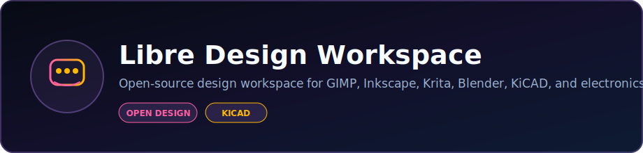

<p align="center">
  
</p>

<p align="center">
  <strong>Open-source design workspace for GIMP, Inkscape, Krita, Blender, KiCAD, and electronics design tools.</strong>
</p>

<p align="center">
  <a href="https://dacameragirl.github.io/libre-design-workspace/"></a>
  <a href="https://github.com/DaCameraGirl/libre-design-workspace"></a>
</p>

<p align="center">
  
  
</p>

### Languages

<p align="center">
  
  
</p>

### Stack

<p align="center">
  
  
</p>

<p align="center">
  Built by <strong>Angela Hudson</strong> · <a href="https://github.com/DaCameraGirl">DaCameraGirl</a>
</p>
# 🔬 Circuit Notebook

**Professional electronics lab notebook for makers, students, and hardware engineers**

A modern desktop application for managing electronics projects, from schematic capture to PCB design to simulation - built with open-source tools.


<p align="center"></p>
<p align="center"></p>


### Project Management
- 📁 Organize multiple electronics projects in one place
- 📝 Rich project documentation with Markdown support
- 🔖 Tag and categorize components
- 📊 Track project versions and history

### BOM Management
- 📋 Automatic Bill of Materials generation
- 🔍 Component database with 1000+ common parts
- 💰 Real-time pricing from distributors (Digi-Key, Mouser)
- 📦 Inventory tracking

### KiCAD Integration
- 🔗 Direct integration with KiCAD 7.0+
- 📐 Open schematics and PCB layouts with one click
- 🔄 Sync component data between Circuit Notebook and KiCAD
- 📤 Export production files

### Circuit Simulation
- ⚡ Built-in SPICE simulator (Ngspice)
- 📈 Visualize waveforms and analysis
- 🧪 Run DC, AC, and transient analyses
- 💾 Save simulation setups with projects

### Documentation
- 📸 Attach photos of prototypes
- 🎥 Embed videos and 3D models
- 📄 Generate PDF reports
- 🌐 Export to HTML for sharing

<p align="center"></p>
<p align="center"></p>


### Installation

**Windows:**
1. Download `Circuit-Notebook-Setup-1.0.0.exe`
2. Run installer
3. Launch from Start Menu

**macOS:**
1. Download `Circuit-Notebook-1.0.0.dmg`
2. Drag to Applications folder
3. Launch from Applications

**Linux:**
```bash
# Debian/Ubuntu
sudo dpkg -i circuit-notebook_1.0.0_amd64.deb

# AppImage (all distros)
chmod +x Circuit-Notebook-1.0.0.AppImage
./Circuit-Notebook-1.0.0.AppImage
```

### First Project

1. Click "New Project"
2. Enter project name and description
3. Add components to your BOM
4. Link KiCAD files (optional)
5. Start documenting!

<p align="center"></p>
<p align="center"></p>


**Core Technologies:**
- Electron - Desktop app framework
- React + TypeScript - UI
- Node.js - Backend

**Design Assets Created With:**
- **GIMP** - UI textures and image assets
- **Inkscape** - Icons and vector graphics
- **Krita** - Digital paintings for onboarding
- **Blender** - 3D component visualizations
- **Libresprite** - Pixel art icons

**Integrates With:**
- KiCAD - PCB design
- LibrePCB - Alternative PCB tool
- Ngspice - Circuit simulation
- Qucs-S - RF simulation

<p align="center"></p>
<p align="center"></p>


### Main Interface
Clean, dark-themed interface designed for long lab sessions.

### Project View
Organize components, schematics, and documentation in one place.

### Simulation Results
Visualize circuit behavior with integrated plotting.

<p align="center"></p>
<p align="center"></p>


**For Students:**
- Document lab experiments
- Learn component identification
- Track project progress for classes
- Build portfolio of work

**For Makers:**
- Manage hobby projects
- Generate shopping lists
- Share designs with community
- Version control for hardware

**For Professionals:**
- Client project documentation
- Design review tracking
- Manufacturing handoff
- Compliance documentation

<p align="center"></p>
<p align="center"></p>


We welcome contributions! Areas we need help:

- Additional component libraries
- Import filters for other EDA tools
- Translations
- Documentation
- Bug reports and feature requests

<p align="center"></p>
<p align="center"></p>


MIT License - see LICENSE file for details

<p align="center"></p>
<p align="center"></p>


Built with open-source tools, for the open-source hardware community.

- KiCAD team for the excellent EDA suite
- Ngspice developers for SPICE simulation
- Electron community
- All contributors and users

---

**Made with ❤️ for makers, by makers**